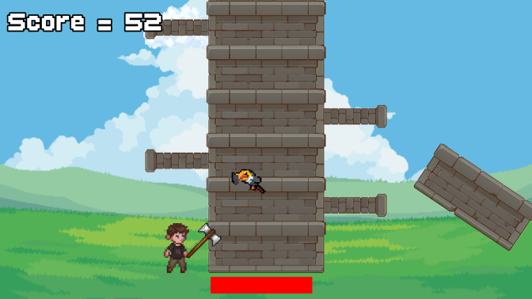
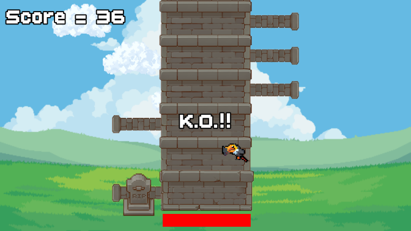
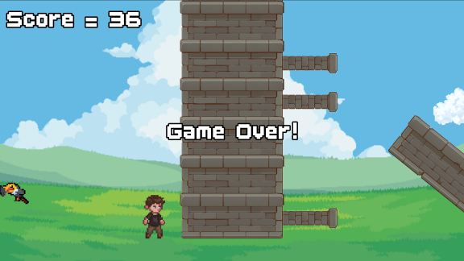

# Tower!: An SFML game project

A small 2D game developed using C++ and SFML to demonstrate knowledge and understanding of C++ fundamentals.

   

## About

*"Tower!"* is a clone of popular game *"Timberman"*, available on Steam [here](https://store.steampowered.com/app/398710/Timberman/), but with a fantasy RPG-esque aesthetic. Instead of a lumberjack dodging branches while felling a tree to score points, the player is a powerful warrior tearing down an evil wizard's tower and dodging tower turrets. 

## Technologies

- C++
- SFML
- Visual Studio Code

## Programming features

**All gameplay programming and game logic were written and implemented by myself**. 
Key features include:
- Player movement left and right
- Simple background animation
- Random number generation
- Collision detection
- Time management
- Audio handling

## Technical notes

Encountered an unexpected issue with the Time Bar when restarting the game with the 'Enter' key from the Game Over / K.O. screen. The first frame after unpausing built a large 'dt' (DeltaTime; time between two frames) that was immediately draining the 'timeRemaining' and creating a very small Time Bar upon restarting. 
I tried a few solutions using additional code, but eventually realised that simply moving the initialisation of 'dt' (dt = clock.restart()) outside of the "if (!paused)" condition was **the most efficient answer**. Other possible solutions I tried include adding another "clock.restart()" when the 'Enter' key is pressed, and and directly readjusting the Time Bar's width using "tbWidthPerSecond = tbStartWidth / timeRemaining".

## Game instructions

Press '**Enter**' to begin the game. 
Use the '**Left**' and '**Right**' keys to move the player character side to side as he attacks the falling tower. 
Successfully dodging the turrets as they come lower increases both the player's score and their remaining time. 
If the Time Bar runs out, or if the player is struck by a turret, it's Game Over / K.O.. To re-play with a score of 0 and refilled time, simply press '**Enter**' again after Game Over / K.O..

## Playing the game

This repository contains the source code for the project. The **finished playable version** will be made **available on itch.io** upon completion of the project. See the links below. 
[GitHub profile](https://github.com/samittarius) | [itch.io profile](https://samittarius.itch.io/) | [Portfolio website](https://samittarius.github.io/)

## Assets

**Third-party assets** were used in the making of this project but are not included in this repository for licensing reasons. 
See [CREDITS.md](CREDITS.md) for more information about the creators, sources, and licences of assets used in this project.
